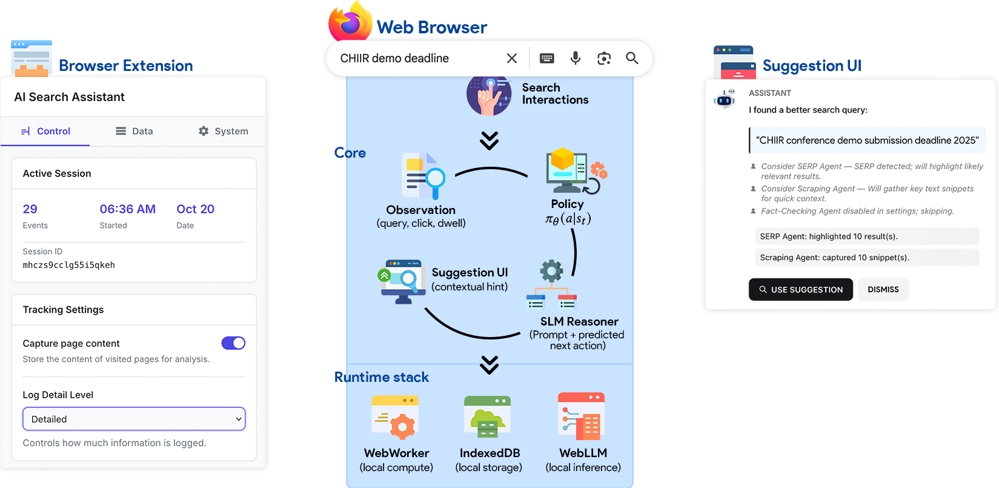
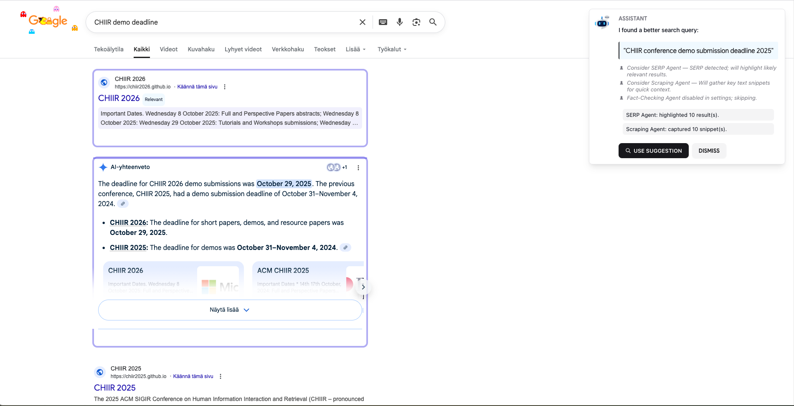

# In-Browser Agents for Search Assistance



[](https://arxiv.org)
[](LICENSE)

This repository contains the source code for the paper **In-Browser Agents for Search Assistance**.

---

## Abstract

> A fundamental tension exists between the demand for sophisticated AI assistance in web search and the need for user data privacy. Current centralized models require users to transmit sensitive browsing data to external services, which limits user control. In this paper, we present a browser extension that provides a viable in-browser alternative. We introduce a hybrid architecture that functions entirely on the client side, combining two components: (1) an adaptive probabilistic model that learns a user's behavioral policy from direct feedback, and (2) a Small Language Model (SLM), running in the browser, which is grounded by the probabilistic model to generate context-aware suggestions. To evaluate this approach, we conducted a three-week longitudinal user study with 18 participants. Our results show that this privacy-preserving approach is highly effective at adapting to individual user behavior, leading to measurably improved search efficiency. This work demonstrates that sophisticated AI assistance is achievable without compromising user privacy or data control.

**Keywords**: *Search Personalization • User Modeling • Browser Extension • Small Language Models*

---

A novel browser extension framework that combines probabilistic user modeling with Large Language Model (LLM) reasoning to provide personalized search assistance while preserving user privacy through client-side processing.

## Demo & Screenshots

### 🎥 Plugin Interface Demo

<p align="center">

https://github.com/user-attachments/assets/361c7569-7c5a-4fb2-9802-6c9c5b7955e9

</p>

<p align="center"><em>The PersonaSearch extension popup interface showing real-time search assistance and persona management</em></p>

### 🎥 Search Interface Demo

<p align="center">

https://github.com/user-attachments/assets/1c2d4604-1261-40a5-8352-129d7e8ff20d

</p>

<p align="center"><em>AI-powered query refinement and contextual suggestions during a search session</em></p>

### 📸 Screenshot

<p align="center">
  
</p>

<p align="center"><em>PersonaSearch seamlessly integrates with Google Search to provide contextual assistance</em></p>

---

## Overview

PersonaSearch is a Firefox browser extension that implements a cognitive-aware search assistant based on the research paper "PersonaSearch: A Unified Framework for Privacy-Preserving, Cognitive-Aware Search Assistance". The system learns from user search behavior to provide contextual suggestions without transmitting personal data to external servers.

## Key Features

### Privacy-First Architecture
- **Client-side processing**: All behavioral analysis and learning occurs locally
- **Encrypted storage**: API keys and sensitive data are encrypted using Web Crypto API
- **No data transmission**: User behavior data never leaves the browser
- **User control**: Complete transparency and control over data collection

### Hybrid AI Architecture
- **Behavioral observation**: Captures search patterns, clicks, and dwell times
- **Probabilistic modeling**: Uses Markov Decision Process (MDP) for behavioral prediction
- **LLM integration**: Leverages OpenAI GPT models for contextual query refinement
- **Adaptive learning**: Continuously personalizes based on user feedback

### Intelligent Search Assistance
- **Query refinement**: AI-powered suggestions to improve search effectiveness
- **Contextual awareness**: Understands user intent within search sessions
- **Non-intrusive interface**: Passive assistance that preserves user agency
- **Real-time adaptation**: Learns from direct user feedback

## Architecture

The framework consists of three core components as described in the research:

### 1. Behavioral Observation and Provenance Engine
Located in `content_scripts/`, this component:
- Monitors user interactions on Google Search pages
- Captures query formulations, result clicks, and page dwell times
- Logs behavioral data locally using secure storage mechanisms
- Operates transparently with user-configurable privacy controls

### 2. Dynamic User Model and State Estimation Core
Implemented across `background.js` and `utils/`, featuring:
- MDP-based modeling of search sessions (states: ViewingSERP, ReadingDocument, ReformulatingQuery)
- Probabilistic prediction of user actions (ClickDocument, ReturnToSERP, SubmitNewQuery)
- Online learning through policy gradient updates based on user feedback
- Local storage of personalized behavioral policies

### 3. Hybrid Cognitive Inference and Suggestion Engine
Powered by `utils/openai-service.js`, providing:
- Translation of probabilistic predictions into natural language suggestions
- LLM-grounded reasoning to ensure contextually relevant assistance
- Support for both cloud-based (OpenAI) and local LLM inference
- User-friendly suggestion interface with accept/reject feedback

## Installation

### Prerequisites
- Firefox browser (Manifest V2 compatible)
- OpenAI API key (for cloud-based LLM features)

### Setup

1. **Clone the repository**
   ```bash
   git clone https://github.com/saberzerhoudi/PersonaSearch
   cd PersonaSearch
   ```

2. **Load the extension in Firefox**
   - Open Firefox and navigate to `about:debugging`
   - Click "This Firefox" → "Load Temporary Add-on"
   - Select the `manifest.json` file from the project directory

3. **Configure API access**
   - Click the extension icon in the Firefox toolbar
   - Enter your OpenAI API key in the settings tab
   - Set an encryption password to secure your API key locally

4. **Privacy configuration**
   - Review and configure data collection preferences
   - Enable/disable specific behavioral tracking features
   - Set data retention policies according to your preferences

## Usage

### Basic Operation

1. **Search normally** on Google - the extension runs passively in the background
2. **Receive suggestions** when the AI identifies opportunities for query improvement
3. **Provide feedback** by accepting or rejecting suggestions to improve personalization
4. **Monitor insights** through the extension popup showing session statistics

### Advanced Features

#### Persona Management
- Create multiple behavioral personas for different search contexts
- Export/import persona configurations for backup or sharing
- Switch between personas based on your current search objectives

#### Performance Monitoring
- View detailed logs of search behavior and system performance
- Analyze personalization effectiveness through the logs interface
- Configure performance thresholds for content processing

#### Security Features
- Encrypted local storage for all sensitive data
- Configurable session timeouts for API key access
- Comprehensive data export and clearing capabilities

## Technical Implementation

### Core Technologies
- **Web Extensions API**: Cross-browser compatibility layer
- **Web Crypto API**: Client-side encryption for secure storage
- **WebAssembly Ready**: Architecture supports local LLM deployment
- **IndexedDB**: Efficient local storage for behavioral data

### Behavioral Modeling
The system implements a Markov Decision Process where:
- **States** represent user context (viewing results, reading documents, etc.)
- **Actions** represent observable behaviors (clicking, querying, navigating)
- **Policy** π(a|s) predicts action probabilities given current state
- **Learning** occurs through policy gradient updates based on user feedback

### Privacy Engineering
- All behavioral data processing occurs within browser Web Workers
- API communications are proxied through the extension background script
- Encryption keys are derived from user passwords using PBKDF2
- No telemetry or analytics data is collected by the extension


## Development

### Project Structure
```
PersonaSearch/
├── manifest.json              # Extension configuration
├── background.js              # Core orchestration and state management
├── content_scripts/           # Behavioral observation components
│   ├── google-search.js       # Google Search page interaction tracking
│   └── page-content.js        # General page content analysis
├── popup/                     # User interface components
│   ├── popup.html             # Main extension interface
│   ├── popup.js               # UI logic and persona management
│   └── popup.css              # Modern styling with CSS variables
├── utils/                     # Core utilities and services
│   ├── openai-service.js      # LLM integration and query refinement
│   ├── secure-storage.js      # Encryption and privacy utilities
│   ├── performance.js         # Performance monitoring and optimization
│   ├── storage.js             # Data persistence management
│   └── logger.js              # Debugging and system logging
├── pages/                     # Additional UI pages
│   └── logs.*                 # Detailed logging interface
└── icons/                     # Extension branding assets
```

### Building and Contributing

1. **Development setup**
   ```bash
   # Install development dependencies (if any)
   npm install
   
   # Run linting and tests
   npm test
   ```

2. **Code style**
   - Use consistent ES6+ JavaScript
   - Follow Mozilla WebExtensions best practices
   - Maintain clear separation of concerns between components
   - Document all public APIs and complex algorithms

3. **Testing behavioral models**
   - Use the logs interface to analyze model performance
   - Test with various search patterns and personas
   - Validate privacy preservation through network monitoring

## Privacy and Security

### Data Handling
- **Local storage only**: All user data remains on the user's device
- **Encryption at rest**: Sensitive data encrypted using industry-standard algorithms
- **No tracking**: No user identification or cross-session tracking
- **Transparent operation**: Full visibility into data collection and usage

### Security Measures
- Content Security Policy (CSP) prevents code injection
- API keys stored with AES-GCM encryption
- Automatic session timeout and key clearing
- Minimal required permissions following least-privilege principle

### User Rights
- Complete data portability through export functionality
- Immediate data deletion capabilities
- Granular control over behavioral tracking features
- Transparent operation with detailed logging

## Future Development

### Planned Enhancements
- **Local LLM Integration**: WebAssembly-based local inference using WebLLM
- **Advanced Behavioral Models**: Reinforcement learning algorithms for better personalization
- **Multimodal Support**: Extension to image and video search contexts
- **Cross-browser Support**: Manifest V3 compatibility for Chrome and Edge

### Research Extensions
- Integration of more sophisticated cognitive models
- Support for collaborative filtering while preserving privacy
- Extended evaluation across diverse search domains
- Real-time adaptation to changing user information needs


